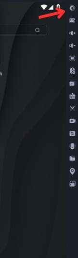
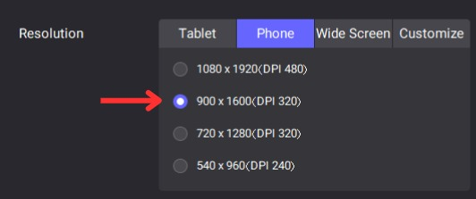
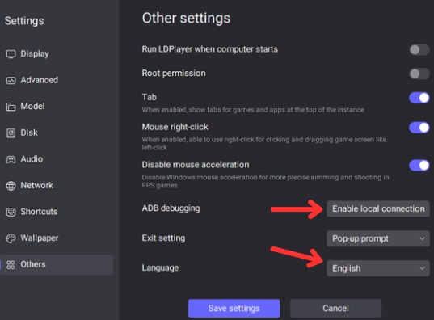
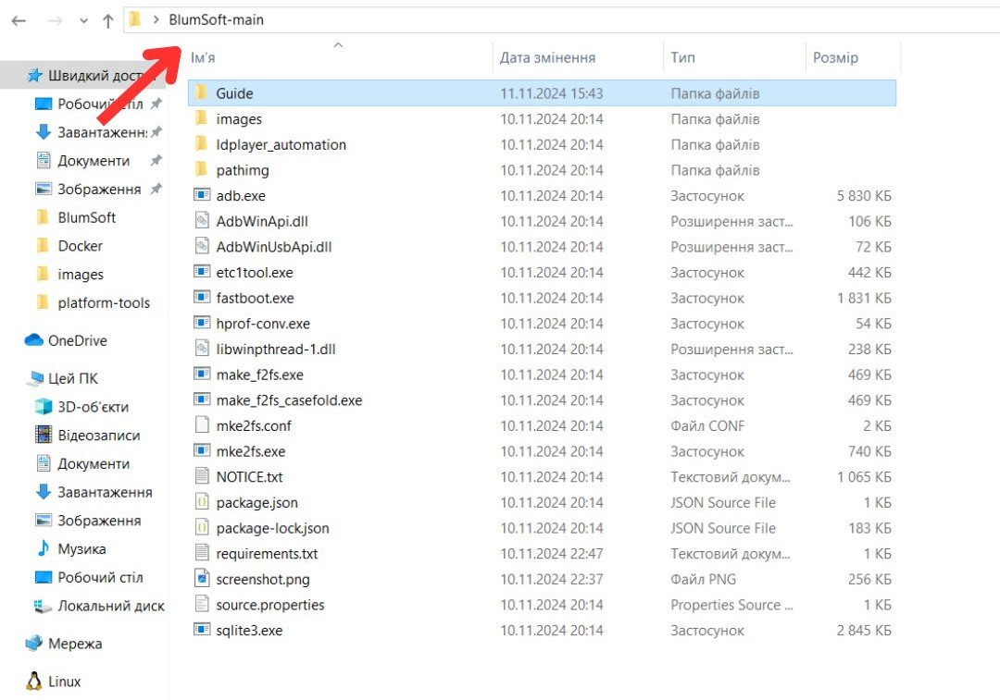
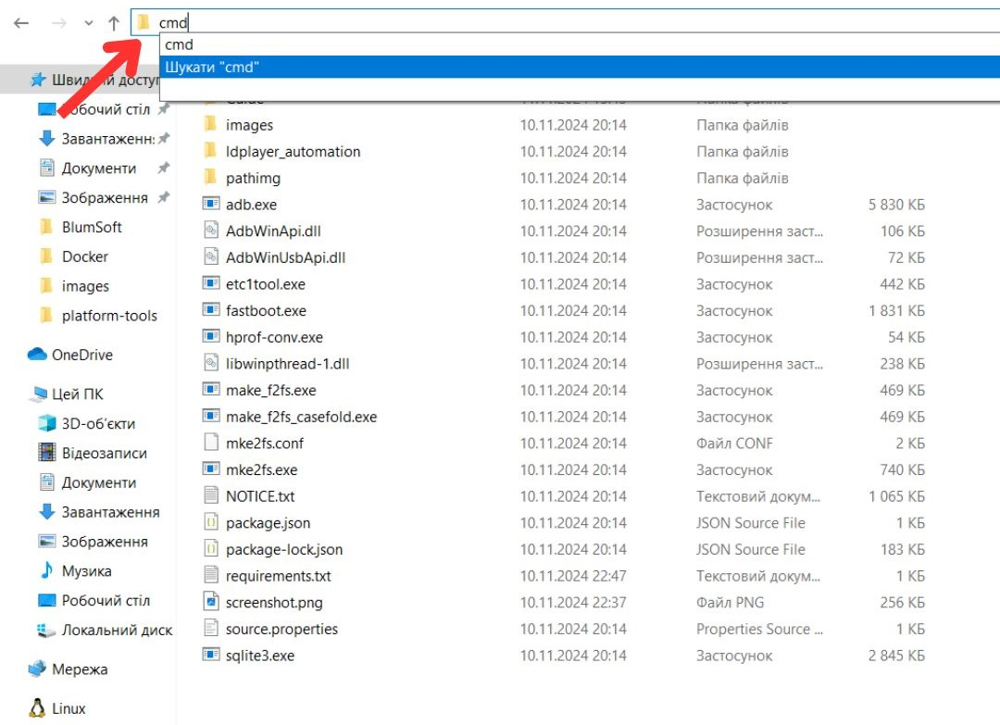
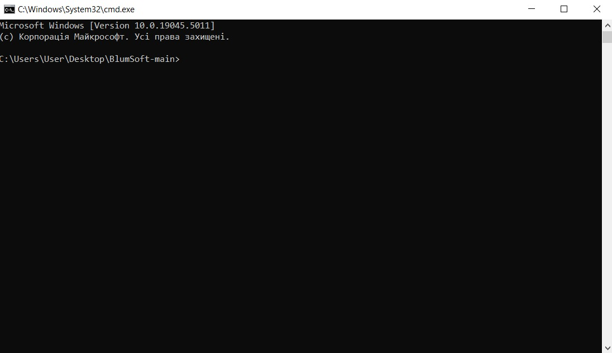
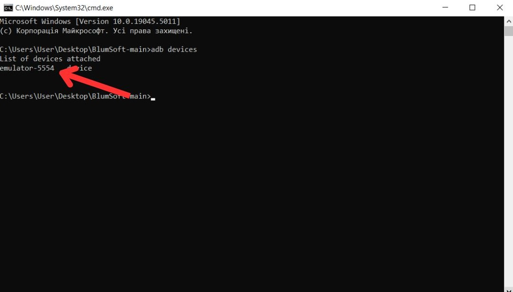

<div align="center">
  <h1>Короткий гайд, що робити, якщо виникають помилки при роботі коду</h1>
  <p>(та як взагалі його запустити)</p>
</div>

1. Перш за все, потрібно завантажити архів і розархівувати його на робочому столі.
2. Запускаємо емулятор та виставляємо правильні налаштування.

<div align="center">
  
  
  
</div>

3. Після цього відкриваємо розархівований файл і повторюємо дії, показані на фото:
<div align="center">
  
  
</div>

Після цього повинно відкритися командне вікно:
<div align="center">
  
</div>

<div align="center">
  Тепер вводимо команду:

  ```bash
  adb devices
  ```
</div>
Копіюємо ім’я нашого емулятора:

<div align="center">  </div>
Заходимо в наш проект та шукаємо файл за таким шляхом:

```bash
BlumSoft-main\ldplayer_automation\automation_script.py
```
У ньому знаходимо наступний рядок та замінюємо його на ім'я нашого емулятора (в лапках):

<div align="center">  </div>
Переходимо до нашого емулятора, завантажуємо Telegram, реєструємося та перезаходимо кілька разів, щоб переконатися, що не з’являються зайві вікна під час входу до Telegram. Також потрібно вимкнути всі повідомлення в налаштуваннях пристрою.

У Telegram створюємо папку Crypto, куди додаємо Blum бота, і все готово! Залишається тільки запустити наш код і насолоджуватися результатом :)

!!! ВАЖЛИВО !!! потрібно щоб папку було видно зразу при вході в телеграм а Blum бота зразу після переходу у цю папку інакше виникнуть помилки !!!
<div align="center">  </div> 

## Контакти
Автор - [Reap4ick](https://github.com/Reap4ick)  
Tg - [@moneiyii](https://t.me/moneiyii)

